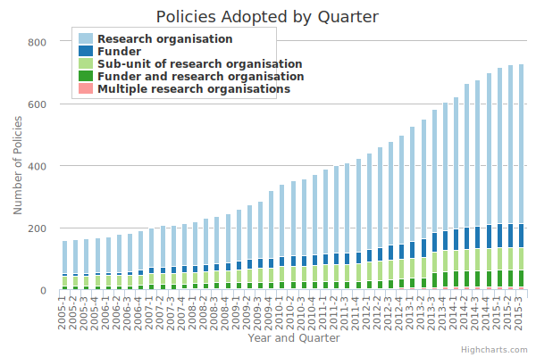

# Care este obiectul?

Rezultatele de cercetare evaluate colegial (peer-review) și datele care stau la baza acestora.

Rezultatele de cercetare în forma lor originală (pre-print) și datele care stau la baza acestora.

# Care este scopul?

Depozitarea, diseminarea, evaluarea, conservarea și exploatarea rezultatelor de cercetare.

# Calea eficientă pentru realizarea unor politici?

Cercetătorilor să le fie solicitat să depoziteze rezultatele de cercetare evaluate colegial în proproiul depozit instituțional acolo unde există sau într-un alt depozit stabilit la nivel național, european sau internațional.

# Când să se facă depozitarea?

Imediat ce rezultatele de cercetare au fost acceptate spre publicare.

# Cum să se facă depozitarea?

Cu acces întârziat (embargo) acolo unde acest lucru se impune.

* *Metadatele să fie disponibile în orice moment*
* *Să existe un mecanism prin care rezultatele să poată fi solicitate - un buton de cerere pentru copie*

# Unde este valoarea în a face depozitare?

Valoarea acestei practici este strâns legată de exercițiile de evaluare a calității și evaluările performanței în cercetare.

# Rolul depozitului în evaluarea calității și a performanței

Oferă informații directe privind indicatorii de audiență și în funcție de extensiile platformei utilizate și alți indicatori utili.

# Politici privind Accesul Deschis

În acest moment în Europa Accesul Deschis la rezultatele de cercetare este mandatoriu pentru proiectele din Horizon 2020 iar în Statele Unite ale Americii există Directiva OSTP pentru agențiile federale.

# Beneficii pentru autori:

- Vizibilitate, gradul de utilizare, impact
- Cercetare mult ai eficientă
- Un proces de cercetare îmbunătățit și fără duplicări
- Parte a unui nou modus operandi

Pentru a avea și mai multe informații bazate pe studii privind citarea lucrărilor științifice în Access Deschis, accesați [The Open Access Citation Advantage](http://sparceurope.org/oaca_list/)

# Beneficii pentru instituții:
- Misiune
- Visibility, usage, impact
- Monitoring and assessment
- Competitive intelligence
- Outreach, return on investment
- Funding

# Benefits to funders:
- Monitoring and assessment
- Return on investment

# Instrumente de evidență existente

[Registry of Open Access REpository Mandates and Policies](http://roarmap.eprints.org/)

[Directory of Open Access Repositories](http://opendoar.org/index.html)

[Directory of Open Access Journals](https://doaj.org/)

[Open Access Tracking Project](http://cyber.law.harvard.edu/hoap/Open_Access_Tracking_Project)

[Open Access Scholarly Information Sourcebook](http://www.openoasis.org)

# Politici existente

## Marea Britanie

### RCUK

Preferă AD de Aur pentru reviste

Permits ‘Green’ OA as an alternative:
Permitted embargoes: 12 mths (STEM and 24 mths (HaSS)
Block grants to pay APCs
Hull:
Year 1: £19,614 (12 articles)
Year 2: £23,075 (14 articles)
Cambridge Yr 2: £1,355,073 (817 articles)

# Ce este necesar pentru România?

România trebuie să-și deschidă rezultatele de cercetare în contextul în care majoritatea contribuțiilor sunt în limba română.

## Condiții existente pentru evidențierea rezultatelor de cercetare

Există un mecanism național de evaluare pentru revistele și editurile reprezentat de [Biroul de Scientometrie](http://www.cncs-nrc.ro/evaluarea-publicatiilor-stiintifice/) al Consiliului Național al Cercetării Științifice. Din nefericire CNCS este inactiv și astfel este atrasă o stagnare a evoluției principiilor privind valorizarea rezultatelor de cercetare românești. Documentul de viziune al CNCS indică și faptul că în procesele de evaluare a calității aporturilor științifice există două principii ghidate exclusiv după indicatori oferiți de serviciile comerciale ale unor mari edituri:
- > Principiul criteriilor minimale de eligibilitate pentru directorii de proiecte. Aceste criterii presupun Scorul de Influenţă a Articolelor ( “Article Influence Score” – AIS). Spre deosebire de factorul de impact, care considera citările unui articol indiferent de unde provin aceste citări, AIS acordă o pondere mai mare citărilor care provin de la reviste cu impact mare în detrimentul acelor citări care provin de la reviste cu impact academic minor.

și

- > Principiul valorizării preferenţiale a producţiei ştiinţifice de calitate. Spre exemplu, calitatea de autor principal, publicarea de articole în reviste “Web of Science” cu AIS ridicat sau publicarea de cărţi cu vizibilitate internaţională sunt indicatori majori care vor fi promovaţi de CNCS în evaluarea producţiei ştiinţifice. Acest lucru este fundamental deoarece doar o producţie ştiinţifică de calitate poate avea apoi impact academic (spre exemplu, atragerea de studenţi), economic, tehnologic şi/sau cultural de anvergura.

Evaluarea publicațiilor științifice românești este centrată pe serviciile comerciale oferite de Thomson Reuters, chiar fiind dată definiția pentru Reviste cotate ISI prin ordin de ministru:
> Definitia unei reviste cotate ISI este publicata in Ordinul de Ministru (MECTS) Nr. 4478 din 23 iunie 2011, publicat in Monitorul Oficial, Partea I, Nr. 448/27.VI.2011, in cadrul secţiunii “DEFINITII” din ANEXA Nr. 2: “O revista cotata ISI este o revista pentru care Thomson Reuters calculează şi publică factorul de impact in Journal Citation Reports.”

## Amendamente Ordonanța de Guvern nr. 57 din 2002

### Comentarii generale

Modificarea OG are șansa de a crește nivelul deschiderii către persoanele implicate în procesele de cercetare-dezvoltare, dar mai ales ar fi un vehicul de întărire a încrederii publicului interesat și larg în contextul „Științei Deschise”. Astfel, articolul 1.1 ar trebui amendat pentru a se permite crearea cadrului de aplicare a policilor comunitare în domeniul cercetării. Astfel, în Secțiunea a 5-a „efectele proiectului de act normativ asupra legislației în vigoare”, aliniatul 2, 3 și 5 vor avea modificări în consecință.

Fiind luat în considerare faptul că instituțiile din sistemul naţional de cercetare-dezvoltare se vor supune „evaluării capacității de a desfășura activități de cercetare-dezvoltare și inovare” printr-o „procedură și metodologie de evaluare a capacității”, cu atât mai mult această procedură trebuie să fie în acord cu practicile europene invocate în Nota de Fundamentare.

„1.1 Prezentul act normativ nu transpune legislaţie comunitară şi nu creează cadrul pentru aplicarea directă a acesteia”. Se pune întrebarea legitimă de ce?

### Punctări din Nota de fundamentare

În Nota de Fundamentare pentru modificările care se doresc a fi făcute la Ordonanța de Guvern nr. 57 din 2002 sunt există câteva puncte majore de interes:
- impactul producției științifice,
- creșterea încrederii [...] opiniei publice
- impactul [...] activităților de cercetare-dezvoltare desfășurate
- elaborarea de norme metodologice de evaluare a capacității,
- elaborarea normelor metodologice privind contractarea, finanţarea, monitorizarea şi evaluarea programelor, proiectelor de cercetare-dezvoltare şi inovare;

### Discuții punctuale pe OG 57/2002 pentru a realiza un cadru Științelor Deschise în România. Întrebări esențiale.

Este necesară o analiză a textului OG pentru a focaliza interesul legiuitorului pentru o mai mare deschidere și transparentizare a rezultatelor sistemului național de cercetare.

#### Art.3, alin. 3, lit. c

Concepte relevante care ar conduce la constituirea depozitelor digitale de cercetare și mai buna gestiune a revistelor electronice:
- > protecția patrimoniului științific național
  1. ***Ce înseamnă a proteja patrimoniul științific național la nivelul rezultatelor de cercetare?***
  2. ***Care este cadrul legal care asigură protecția?***
  3. ***Care este mecanismul prin care se face această protecție?***
  4. ***Care sunt organele și liniile de finanțare pentru protejarea patrimoniului științific?***
  5. ***Care este cuantumul din bugetul cercetării pentru protecția patrimoniului științific?***

- > difuzarea, absorbția și valorificarea rezultatelor activității de cercetare-dezvoltare în scopul dezvoltării economice durabile, al creșterii bunăstării și calității vieții, al îmbogățirii patrimoniului național și internațional al cunoașterii

Această protecție trebuie realizată în tandem cu deschiderea accesului la rezultatele proiectelor de cercetare și acolo unde este posibil, la seturile de date care stau la baza lor.

Acest concept de protecție prin efectul său, adică realizarea unui posibil depozit național dedicat rezultatelor științifice, nu va avea suport și aderență pe termen lung dacă nu va oferi accesul la literatura de specialitate și datele care o însoțesc.

Cea mai bună protecție nu poate fi făcută decât dovedind valoare prin deschidere.

Dezvoltarea economică poate fi realizată în cadrul științelor deschise așa cum multe studii o demonstrează în acest moment.

[Analiza articolului 3](#TODO:0 profile:productie profile: evaluarecapacitati @OG57 @productiestiintifica Argumentează cu menționarea studiilor)

#### Art.5, alin. 2

Este articolul care indică cine are acces la finanțarea publică a cercetării, dar cel mai important lucru care trimite către stabilirea unui cadru de exploatare a resurselor digitale ca rezultate de cercetare, este:
> respectarea prevederilor legale şi contractuale privind drepturile de proprietate intelectuală şi de utilizare a rezultatelor

1. ***Prevederile legale*** - vezi anexa 1 dedicată cadrului legal
2. ***Prevederi contractuale***

# Mediul universitar

Activitatea și organizarea cercetării la nivelul învățământului superior este regelementată prin efectele Legii învățământului (1 din 2011) și Legii 206 privind buna conduită în cercetarea ştiinţifică, dezvoltarea tehnologică şi inovare.

Elementele principale care au capacitatea de  introduce Accesul Deschis ca element de conduită echitabilă privind contribuțiile în domeniul cercetării științifice sunt:
- Carta universitară

## Anexa 1 - Cadrul legal, fragmente relevante

- [Legea Drepturilor de Autor - LEGE nr. 8 din 14 martie 1996](http://ogp.gov.ro/noutati/oportunitatea-publicarii-legislatiei-online-contestata-in-justitie/#more-1449)

- [Legea statutul personalului de cercetare-dezvoltare - LEGE nr. 319 din 8 iulie 2003](http://legislatie.just.ro/Public/DetaliiDocument/45166)
  > reglementează statutul personalului de cercetare-dezvoltare şi stabileşte drepturile şi obligaţiile specifice

  - Art.4
    > Activitatea personalului de cercetare-dezvoltare este de interes naţional şi cuprinde:

    > a) dezvoltarea cunoştinţelor ştiinţifice;

    > b) ***participarea la transferul cunoştinţelor şi tehnologiilor în toate domeniile vieţii economice şi sociale***;

    > c) participarea la valorificarea eficienta a rezultatelor activităţii de cercetare-dezvoltare, pentru dezvoltarea durabila a societăţii.

  - Art. 24
    > b) să respecte drepturile de proprietate intelectuală şi confidenţialitatea convenită cu colaboratorii şi cu finantatorii cercetării;

    > f) sa participe la evaluarea activităţii de cercetare-dezvoltare, precum şi a rezultatelor proprii;

    > i) să-şi dezvolte continuu cunoştinţele ştiinţifice şi tehnice şi să contribuie la diseminarea informatiei şi culturii ştiinţifice şi tehnice, precum şi la constientizarea publicului şi a factorilor de decizie asupra rolului ştiinţei şi tehnicii;

  - Art. 25
    > (1) La încetarea activităţii în instituţie sau unitate, personalul de cercetare-dezvoltare nu poate folosi rezultatele ştiinţifice şi tehnice care au fost obţinute în unitate în cadrul unor lucrări finanţate din fonduri publice, pe o durată de cel puţin 5 ani, fără acordul finanţatorului.

  - Art. 31
    > Autoritatea de stat pentru cercetare-dezvoltare şi ordonatorii principali de credite care finanţează activităţi de cercetare-dezvoltare asigura cadrul de reglementare compatibil cu spaţiul european şi mondial al cercetării-dezvoltării, pentru accesul cercetatorilor la patrimoniul tehnic şi ştiinţific, în condiţiile legii, şi pentru asigurarea unor condiţii atractive de muncă.

- [Legea privind buna conduită în cercetarea ştiinţifică, dezvoltarea tehnologică şi inovare - LEGE nr. 206 din 27 mai 2004](http://legislatie.just.ro/Public/DetaliiDocument/52457)
  - Art. 2
    > Normele de bună conduită în activitatea de cercetare-dezvoltare includ:

    > a) norme de bună conduită în activitatea ştiinţifică;

    > b) ***norme de bună conduită în activitatea de comunicare, publicare, diseminare şi popularizare ştiinţifică, inclusiv în cadrul cererilor de finanţare depuse în cadrul competiţiilor de proiecte organizate din fonduri publice***;

    > c) norme de bună conduită în activitatea de evaluare şi monitorizare instituţională a cercetării-dezvoltării, de evaluare şi monitorizare de proiecte de cercetare-dezvoltare obţinute prin acţiuni din cadrul Planului Naţional de Cercetare, Dezvoltare şi Inovare şi de evaluare de persoane în vederea acordării de grade, titluri, funcţii, premii, distincţii, sporuri, atestate sau certificate în activitatea de cercetare-dezvoltare;

  - Art. 2^1
    > (1) Abaterile de la normele de bună conduită prevăzute la art. 2 lit. a), în măsura în care nu constituie infracţiuni potrivit legii penale, includ:

    > a) ***confecţionarea de rezultate sau date*** şi prezentarea lor ca date experimentale, ca date obţinute prin calcule sau simulări numerice pe calculator ori ca date sau rezultate obţinute prin calcule analitice ori raţionamente deductive;

    > b) ***falsificarea de date experimentale***, de date obţinute prin calcule sau simulări numerice pe calculator ori de date sau rezultate obţinute prin calcule analitice ori raţionamente deductive;

    > c) îngreunarea deliberată, împiedicarea sau sabotarea activităţii de cercetare-dezvoltare a altor persoane, inclusiv prin blocarea nejustificată a accesului la spaţiile de cercetare-dezvoltare, prin avarierea, distrugerea ori ***manipularea aparaturii experimentale, a echipamentului, a documentelor, a programelor de calculator, a datelor în format electronic, a substanţelor organice sau anorganice ori a materiei vii necesare altor persoane pentru derularea, realizarea sau finalizarea activităţilor de cercetare-dezvoltare***.

    > (2) Abaterile de la normele de bună conduită prevăzute la art. 2 lit. b), în măsura în care nu constituie infracţiuni potrivit legii penale, includ:

    > a) plagiatul;

    > b) autoplagiatul;

    > c) includerea în lista de autori a unei publicaţii ştiinţifice a unuia sau mai multor coautori care nu au contribuit semnificativ la publicaţie ori excluderea unor coautori care au contribuit semnificativ la publicaţie; d) includerea în lista de autori a unei publicaţii ştiinţifice a unei persoane fără acordul acesteia; e) publicarea sau diseminarea neautorizată de către autori a unor rezultate, ipoteze, teorii ori metode ştiinţifice nepublicate; f) introducerea de informaţii false în solicitările de granturi sau de finanţare, în dosarele de candidatură pentru abilitare, pentru posturi didactice universitare ori pentru posturi de cercetare-dezvoltare. (3) Abaterile de la normele de bună conduită prevăzute la art. 2 lit. c), în măsura în care nu constituie infracţiuni potrivit legii penale, includ: a) nedezvăluirea situaţiilor de conflicte de interese în realizarea sau participarea la evaluări; b) nerespectarea confidenţialităţii în evaluare; c) discriminarea, în cadrul evaluărilor, pe criterii de vârstă, etnie, sex, origine socială, orientare politică sau religioasă, orientare sexuală ori alte tipuri de discriminare, cu excepţia măsurilor afirmative prevăzute de lege. (4) Abaterile de la normele de bună conduită prevăzute la art. 2 lit. d), în măsura în care nu constituie infracţiuni potrivit legii penale, includ: a) abuzul de autoritate pentru a obţine calitatea de autor sau coautor al publicaţiilor persoanelor din subordine; b) abuzul de autoritate pentru a obţine salarizare, remunerare sau alte beneficii materiale din proiectele de cercetare-dezvoltare conduse ori coordonate de persoane din subordine; c) abuzul de autoritate pentru a obţine calitatea de autor sau coautor al publicaţiilor persoanelor din subordine ori pentru a obţine salarizare, remunerare sau alte beneficii materiale pentru soţi, afini ori rude până la gradul al III-lea inclusiv; d) abuzul de autoritate pentru a impune nejustificat propriile teorii, concepte sau rezultate asupra persoanelor din subordine; e) obstrucţionarea activităţii unei comisii de etică, a unei comisii de analiză sau a Consiliului Naţional de Etică, în cursul unei analize a unor abateri de la buna conduită în activitatea de cercetare-dezvoltare din subordine; f) nerespectarea prevederilor şi procedurilor legale destinate respectării normelor de bună conduită în activitatea de cercetare-dezvoltare prevăzute în prezenta lege, în Legea nr. 1/2011, în Codul de etică, în codurile de etică pe domenii, în regulamentele de organizare şi funcţionare a instituţiilor de cercetare-dezvoltare, respectiv în cartele universitare, după caz, inclusiv nepunerea în aplicare a sancţiunilor stabilite de către comisiile de etică conform art. 11 alin. (6) din prezenta lege sau de către Consiliul Naţional de Etică, conform art. 326 din Legea nr. 1/2011. (5) Abaterile de la normele de bună conduită prevăzute la art. 2 lit. e) sunt detaliate în Codul de etică sau în codurile de etică pe domenii. (6) Următoarele situaţii pot de asemenea să atragă răspunderea etică prin asociere pentru abateri de la buna conduită în activitatea de cercetare-dezvoltare: a) participarea activă în abateri săvârşite de alţii; b) cunoaşterea abaterilor săvârşite de alţii şi nesesizarea comisiei de etică prevăzute la art. 9 sau a Consiliului Naţional de Etică; c) coautoratul publicaţiilor conţinând date falsificate sau confecţionate; d) neîndeplinirea obligaţiilor legale şi contractuale, inclusiv a celor aferente contractului de mandat sau contractelor de finanţare, în exercitarea funcţiilor de conducere ori de coordonare a activităţilor de cercetare-dezvoltare.-------Art. 2^1 a fost introdus de pct. 3 al art. unic din ORDONANŢA nr. 28 din 31 august 2011, publicată în MONITORUL OFICIAL nr. 628 din 2 septembrie 2011.

  - Art. 4
    > (1) În sensul prezentei legi, următorii termeni sunt definiţi după cum urmează:

    > a) ***coautor al unei publicaţii*** - orice persoană nominalizată în lista de autori a unei publicaţii ştiinţifice;

    > b) ***confecţionarea de rezultate sau date*** - raportarea de rezultate sau date fictive, care nu sunt rezultatul real al unei activităţi de cercetare-dezvoltare;

    > c) ***falsificarea de rezultate sau date*** - raportarea selectivă sau respingerea datelor ori a rezultatelor nedorite; manipularea reprezentărilor sau a ilustraţiilor; alterarea aparatului experimental ori numeric pentru a obţine datele dorite fără a raporta alterările efectuate;

    > d) ***plagiatul*** - expunerea într-o operă scrisă sau o comunicare orală, inclusiv în format electronic, a unor texte, expresii, idei, demonstraţii, date, ipoteze, teorii, rezultate ori metode ştiinţifice extrase din opere scrise, inclusiv în format electronic, ale altor autori, fără a menţiona acest lucru şi fără a face trimitere la sursele originale;

    > e) ***autoplagiatul*** - expunerea într-o operă scrisă sau o comunicare orală, inclusiv în format electronic, a unor texte, expresii, demonstraţii, date, ipoteze, teorii, rezultate ori metode ştiinţifice extrase din opere scrise, inclusiv în format electronic, ale aceluiaşi sau aceloraşi autori, fără a menţiona acest lucru şi fără a face trimitere la sursele originale.

    > (2) Abaterile grave de la buna conduită în activitatea de cercetare-dezvoltare sunt cele prevăzute la art. 310 din Legea nr. 1/2011

  - Capitolul II Consiliul Naţional de Etică a Cercetării Ştiinţifice, Dezvoltării Tehnologice şi Inovării, Art.5, alin. 1
    > În vederea coordonării şi monitorizării aplicării normelor de conduită morală şi profesională în activităţile de cercetare-dezvoltare, se înfiinţează Consiliul Naţional de Etică a Cercetării Ştiinţifice, Dezvoltării Tehnologice şi Inovării, denumit în continuare Consiliul Naţional de Etică, organism consultativ, fără personalitate juridică, pe lângă autoritatea de stat pentru cercetare-dezvoltare.

    alin. 4
    > Pentru activitatea desfăşurată, membrii Consiliului Naţional de Etică şi membrii grupurilor de lucru ale acestuia, care nu sunt membri ai Consiliului Naţional de Etică, primesc o indemnizaţie lunară din bugetul Autorităţii Naţionale pentru Cercetare Ştiinţifică, în raport cu activitatea depusă.

  - Art. 7
    > Consiliul Naţional de Etică are următoarele atribuţii:

    > a) propune modificări ale Codului de etică;

    > b) elaborează coduri de etică pe domenii ştiinţifice, pe care le propune spre aprobare autorităţii de stat pentru cercetare-dezvoltare;

    > d) urmăreşte aplicarea şi respectarea de către unităţile şi instituţiile de cercetare-dezvoltare, precum şi de către personalul de cercetare-dezvoltare a dispoziţiilor legale referitoare la normele de conduită morală şi profesională;

    > e) formulează opinii şi recomandări în legătură cu problemele de natură etică ridicate de evoluţia ştiinţei şi a cunoaşterii;

  - Art. 8, alin. 1
    > Consiliul Naţional de Etică îşi poate constitui grupuri de lucru pe domenii de ştiinţă şi tehnologie, cu statut permanent sau temporar, potrivit prevederilor Regulamentului de organizare şi funcţionare al Consiliului Naţional de Etică, în condiţiile legii.

  - Art. 15
    > Codurile etice pe domenii ale cercetării se elaborează de Consiliul Naţional de Etică, în termen de 180 de zile de la intrarea în vigoare a prezentei legi, şi se aprobă prin ordin al conducătorului autorităţii de stat pentru cercetare-dezvoltare.

- [Legea educației naționale - LEGE nr. 1 din 5 ianuarie 2011](http://legislatie.just.ro/Public/DetaliiDocumentAfis/125150)
  - Art. 130, alin. 2
    > d) rezultatele activităţilor de cercetare;
  - Secţiunea a 3-a ***Rolul statului în învăţământul superior***,

    - Art. 216, alin. 2
      > Ministerul Educaţiei, Cercetării, Tineretului şi Sportului are următoarele atribuţii principale:

      lit. c)
      > monitorizează şi verifică direct sau prin organismele abilitate în acest sens respectarea reglementărilor privind organizarea şi funcţionarea învăţământului superior, ***cercetarea universitară***, managementul financiar, etica universitară şi asigurarea calităţii în învăţământul superior;

    - Art. 217, alin. 1
      > Pentru exercitarea atribuţiilor sale, Ministerul Educaţiei, Cercetării, Tineretului şi Sportului constituie registre de experţi şi se sprijină pe organisme consultative, la nivel naţional, alcătuite pe criterii de prestigiu profesional şi moral: Consiliul Naţional de Statistică şi Prognoză a Învăţământului Superior (CNSPIS), Consiliul Naţional de Atestare a Titlurilor, Diplomelor şi Certificatelor Universitare (CNATDCU), Consiliul Naţional al Cercetării Ştiinţifice (CNCS), Colegiul consultativ pentru cercetare-dezvoltare şi inovare (CCCDI), Consiliul Naţional pentru Finanţarea Învăţământului Superior (CNFIS), Consiliul Naţional al Bibliotecilor Universitare (CNBU), Consiliul de etică şi management universitar (CEMU) şi Consiliul Naţional de Etică a Cercetării Ştiinţifice, Dezvoltării Tehnologice şi Inovării (CNECSDTI).

      alin. 3
      > Bugetele acestor organisme sunt gestionate prin Unitatea executivă pentru finanţarea învăţământului superior, a cercetării, dezvoltării şi inovării (UEFISCDI) şi se constituie pe bază contractuală între Ministerul Educaţiei, Cercetării, Tineretului şi Sportului şi UEFISCDI sau din alte surse legal constituite, gestionate de UEFISCDI.

    - Art. 218, alin. 3
      > Consiliul Naţional de Etică a Cercetării Ştiinţifice, Dezvoltării Tehnologice şi Inovării este organismul prevăzut de Legea nr. 206/2004 privind buna conduită în cercetarea ştiinţifică, dezvoltarea tehnologică şi inovare, cu modificările şi completările ulterioare.

    - Art. 219, alin. 3
      > CNCS are următoarele atribuţii principale: a) stabileşte standardele, criteriile şi indicatorii de calitate pentru cercetarea ştiinţifică, aprobate prin ordin al ministrului educaţiei, cercetării, tineretului şi sportului; b) auditează periodic, la solicitarea Ministerului Educaţiei, Cercetării, Tineretului şi Sportului sau din proprie iniţiativă, cercetarea ştiinţifică universitară ori din unităţile de cercetare-dezvoltare; c) gestionează programe de cercetare şi procese de evaluare a proiectelor de cercetare care sunt propuse pentru finanţare competitivă; d) prezintă anual Ministerului Educaţiei, Cercetării, Tineretului şi Sportului un raport privind starea cercetării ştiinţifice în învăţământul superior şi performanţele universităţilor. Raportul este public şi va fi afişat pe site-ul CNCS.

      alin. 4
      > Consiliul Naţional al Bibliotecilor Universitare (CNBU) are în atribuţii elaborarea strategiei de dezvoltare, evaluare periodică şi coordonarea sistemului de biblioteci din învăţământul superior.

    - Art. 221, alin. 1
      > Ministerul Educaţiei, Cercetării, Tineretului şi Sportului îşi realizează atribuţiile în domeniul cercetării prin Autoritatea Naţională de Cercetare Ştiinţifică, conform legii.

    - Art. 223, alin. 6
      > Finanţarea complementară se realizează de Ministerul Educaţiei, Cercetării, Tineretului şi Sportului prin:

      lit. c
      > fonduri alocate pe baze competiţionale pentru cercetarea ştiinţifică universitară.

      alin. 8
      > Finanţarea cercetării ştiinţifice universitare se face conform prevederilor Ordonanţei Guvernului nr. 57/2002 privind cercetarea ştiinţifică şi dezvoltarea tehnologică, aprobată cu modificări şi completări prin Legea nr. 324/2003, cu modificările şi completările ulterioare, şi legislaţiei specifice domeniului cercetării-dezvoltării.

    - Art. 288, alin. 2
      > Activităţile din granturi sau contractele de cercetare se remunerează conform deciziei directorului de grant, conform legii şi prevederilor Cartei universitare.

    - Art. 303, alin. 3 și 4
      >  Salarizarea personalului didactic şi de cercetare se face şi în funcţie de rezultatele şi performanţele acestuia, conform legii. (4) Contractele de muncă ale personalului didactic şi de cercetare includ asumarea unor ***standarde minime ale rezultatelor activităţilor didactice şi de cercetare*** şi clauze privind încetarea contractelor în condiţiile neîndeplinirii acestor standarde minime.

    - Secţiunea a 4-a Drepturi şi obligaţii ale personalului didactic, Art. 304
      >(1) Personalul din învăţământul superior are ***drepturi şi îndatoriri care decurg din Carta universitară, din Codul de etică universitară, din contractul individual de muncă, precum şi din legislaţia în vigoare***.

      >(2) ***Protecţia drepturilor salariaţilor, precum şi a drepturilor de proprietate intelectuală asupra creaţiei ştiinţifice, culturale sau artistice este garantată şi se asigură în conformitate cu prevederile Cartei universitare şi cu legislaţia specifică în vigoare***.

      > (3) ***Membrilor comunităţii universitare le este garantată libertatea academică. În baza acesteia, ei pot exprima liber opinii academice în spaţiul universitar şi au libertatea de predare, de cercetare şi de creaţie, în conformitate cu criteriile de calitate academică***.

      >(4) ***Personalul didactic şi de cercetare are dreptul de a publică studii, articole, volume sau opere de artă, de a candida la obţinerea de granturi naţionale şi internaţionale, fără restricţii ale libertăţii academice***.

    - Secţiunea a 5-a Etica universitară, Art. 306
      > (1) La nivelul fiecărei universităţi funcţionează comisia de etică universitară.

      > (2) Structura şi componenţa comisiei de etică universitară este propusă de consiliul de administraţie, avizată de senatul universitar şi aprobată de rector. Membrii comisiei sunt persoane cu prestigiu profesional şi autoritate morală. Nu pot fi membri ai comisiei de etică universitară persoanele care ocupă vreuna dintre funcţiile: rector, prorector, decan, prodecan, director administrativ, director de departament sau de unitate de cercetare-dezvoltare, proiectare, microproducţie.

      > (3) Comisia de etică universitară are următoarele atribuţii: a) analizează şi soluţionează abaterile de la etica universitară, pe baza sesizărilor sau prin autosesizare, conform Codului de etică şi deontologie universitară; b) realizează un raport anual referitor la situaţia respectării eticii universitare şi a eticii activităţilor de cercetare, care se prezintă rectorului, senatului universitar şi constituie un document public; c) contribuie la elaborarea Codului de etică şi deontologie universitară, care se propune senatului universitar pentru adoptare şi includere în Carta universitară; d) atribuţiile stabilite de Legea nr. 206/2004, cu modificările şi completările ulterioare; e) alte atribuţii prevăzute de prezenta lege sau stabilite conform Cartei universitare, conform legii.

    - Art. 307
      > Hotărârile comisiei de etică universitară sunt avizate de consilierul juridic al universităţii. Răspunderea juridică pentru hotărârile şi activitatea comisiei de etică universitară revine universităţii.

    - Art. 310
      > Constituie abateri grave de la buna conduită în cercetarea ştiinţifică şi activitatea universitară: a) ***plagierea rezultatelor sau publicaţiilor altor autori***; b) ***confecţionarea de rezultate sau înlocuirea rezultatelor cu date fictive***; c) ***introducerea de informaţii false în solicitările de granturi sau de finanţare***.

    - Art. 323
      > (1) Consiliul Naţional de Etică a Cercetării Ştiinţifice, Dezvoltării Tehnologice şi Inovării analizează cazurile referitoare la încălcarea regulilor de bună conduită în cercetare-dezvoltare, în urma sesizărilor sau prin autosesizare, şi emite hotărâri prin care se stabileşte vinovăţia ori nevinovăţia persoanei sau persoanelor în cauză; în cazurile hotărârilor privind vinovăţia, hotărârile stabilesc şi sancţiunile ce urmează a fi aplicate, conform legii. (2) Consiliul Naţional de Etică a Cercetării Ştiinţifice, Dezvoltării Tehnologice şi Inovării păstrează confidenţială identitatea persoanei care a făcut sesizarea. (3) Hotărârile Consiliului Naţional de Etică a Cercetării Ştiinţifice, Dezvoltării Tehnologice şi Inovării sunt avizate de direcţia juridică din cadrul Ministerului Educaţiei, Cercetării, Tineretului şi Sportului. Răspunderea juridică pentru hotărârile Consiliului Naţional de Etică a Cercetării Ştiinţifice, Dezvoltării Tehnologice şi Inovării revine Ministerului Educaţiei, Cercetării, Tineretului şi Sportului.
